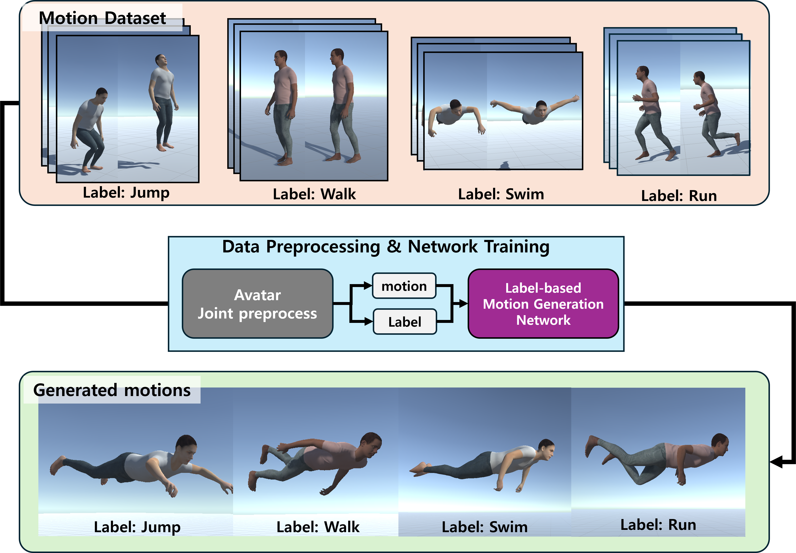
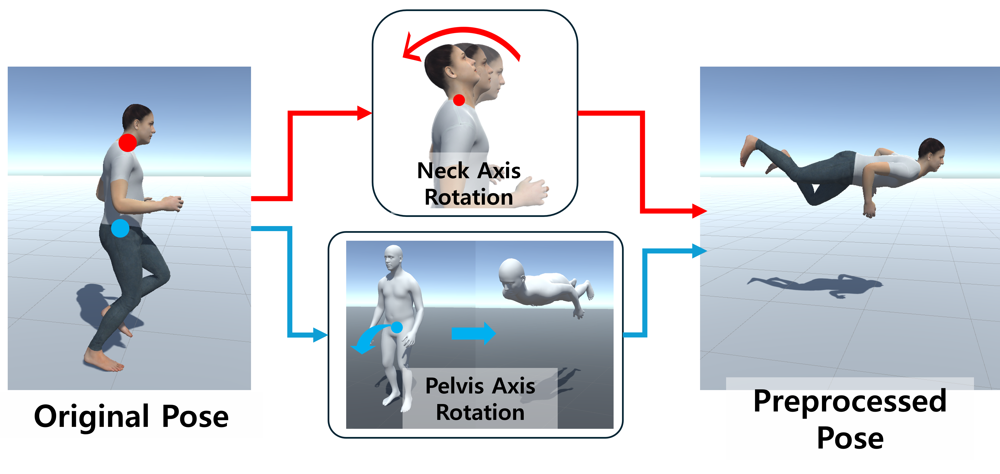
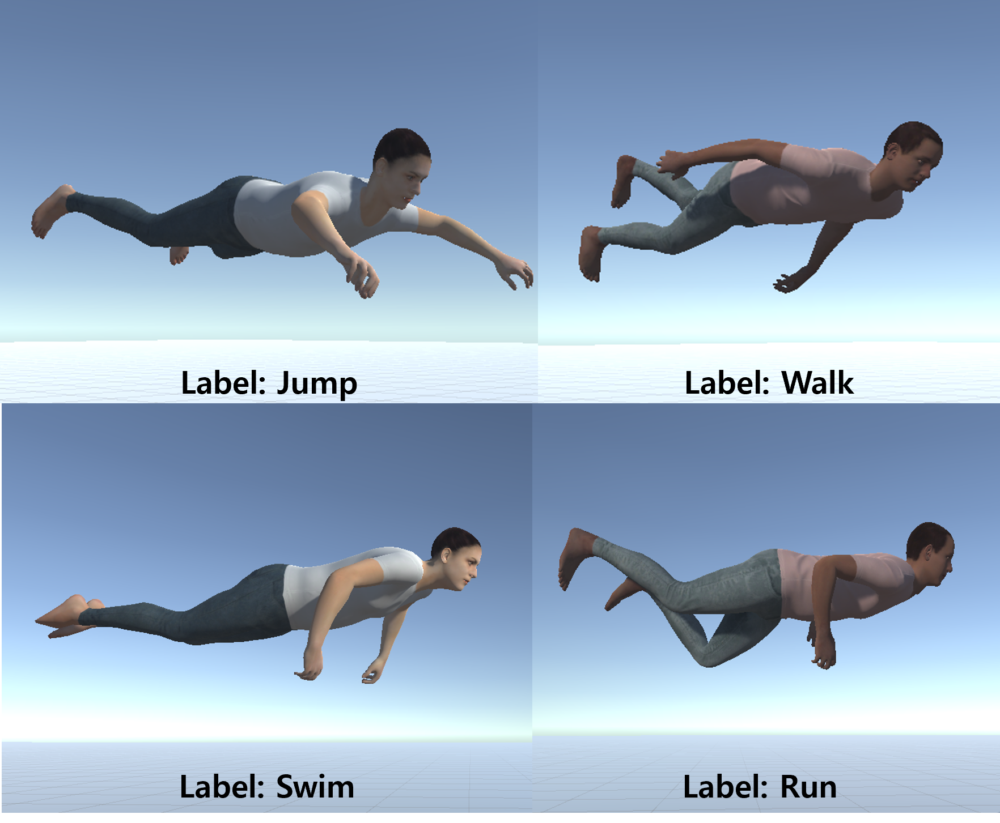

# **Flying-motion Generation via Motion Dataset Adaptation**

- 이 프로젝트는 Action-label based Motion Generation Network인 **ACTOR**를 커스텀 데이터셋으로 재학습해 결과를 확인한 프로젝트임.
- 데이터 학습을 위해 네트워크의 일부를 수정했고, 원본 리드미는 [ACTOR_README.md](https://github.com/JuicyJeong/ACTOR_jw/blob/master/ACTOR_README.md)에서 확인할 수 있음.
- 이 내용을 바탕으로 **VRST 2024 학회 포스터 세션**에 참여했음. 자세한 내용은 [Paper Link](https://dl.acm.org/doi/10.1145/3641825.3689507)에서 확인할 수 있음.

## 프로젝트에서 기여한 점:

- 데이터 형태 파악 및 데이터셋 샘플링
- 데이터셋 일괄 전처리
- 네트워크 학습을 위한 데이터셋 설정

## Motivation

동작 생성 네트워크에서 기존의 사람 움직임을 생성하는 건 비교적 쉬움. 하지만 학습된 적 없는 동작을 생성하는 건 어려움이 따름. 예를 들어, 가상 환경의 아바타가 공중을 나는 동작을 생성하는 건 동작 생성 네트워크에서 어려운 작업임.

## 제안 방법

이 프로젝트는 아바타의 비행 동작을 동작 생성 네트워크에서 생성할 수 있도록 기존의 데이터셋을 변형해 일부를 샘플링한 후, 적은 양의 데이터를 동작 생성 네트워크에 훈련시켜 결과를 확인함.

전체 데이터셋에 대해 일괄적으로 전처리를 진행함.

전처리는 간단하며, SMPL 포맷 형식의 아바타에서 Pelvis 관절과 Neck 관절의 각도를 조절하여 허공에 떠 있는 동작처럼 보이게 함.

[관련 코드](https://github.com/JuicyJeong/ACTOR_jw/blob/master/src/datasets/datapreprop/roatate_amass.ipynb)

## 데이터셋 샘플링 및 구축
비행 동작처럼 보이는 동작들을 임의로 선정한 action label을 바탕으로 소규모 데이터셋을 샘플링함.

전처리된 데이터셋 중 일부 동작을 선정하여 새로운 소규모 샘플링 데이터셋을 구축함.

대규모 데이터셋에는 동작 라벨이 클래스로 구분된 것이 아니라, 모션과 텍스트 설명 파일이 일대일로 매핑되어 있어서 동작 선정에 어려움이 있었음.

### 해결 방법
모든 텍스트 설명을 하나의 딕셔너리 형태로 병합한 후, 라벨 키워드를 검색해 해당 데이터를 샘플링하여 데이터셋을 구성함.

* 텍스트 병합 후 검색 코드

* [mergetext.ipynb](https://github.com/JuicyJeong/ACTOR_jw/blob/master/src/datasets/datapreprop/mergetxt.ipynb)

* [find_KEYWORD_npz.ipynb](https://github.com/JuicyJeong/ACTOR_jw/blob/master/src/datasets/datapreprop/find_KEYWORD_npz.ipynb)
## 데이터 학습 및 결과
모션 생성 네트워크에 커스텀 데이터셋을 학습시키기 위해 별도의 세팅이 필요했으며, 데이터 입력을 위한 스크립트 작업을 진행함.

Flying Pose 적용 코드
[flying_poses.py](https://github.com/JuicyJeong/ACTOR_jw/blob/master/src/datasets/flying_poses.py)

학습이 완료된 후, 생성된 동작들을 확인함. 그러나 렌더링 시 카메라의 perspective가 의도치 않은 방향으로 고정되어, 유니티를 통해 해당 동작들을 변환 및 시각화함.

## 부족한 점
* 비행 동작에서 중요한 점은 공중에 떠 있는 것뿐만 아니라, 비행 궤적을 포함해야 더 자연스러운 결과를 얻을 수 있었음.
* 이를 해결하기 위해 3차원 궤적을 생성하고 비행 동작을 함께 적용하는 방법을 추가 연구할 예정.
